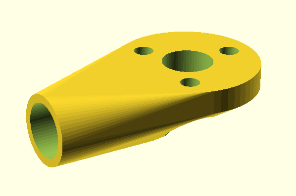
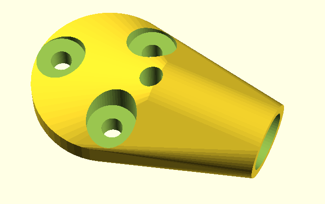

# Drone Frame Part OpenSCAD 

Parameterized OpenSCAD drone frame parts for 3D printing

## Cura 3D Printer Settings

Material: PET-G  
Method: extra fast  
Layer: 0.3mm  
Wall thickness: 0.8mm  
Wall line count: 2  
Top/bottom thickness: 0.8mm  
top/bottom layers: 3  
Infil densitiy: 100%  
Printing temperature: 215C  
Build plate temperature: 70C  
Print speed: 60mm/s  
Enable retracton: NO  
Enable print cooling: YES  
Support: NO  
Build plate adhesion: Skirt  

