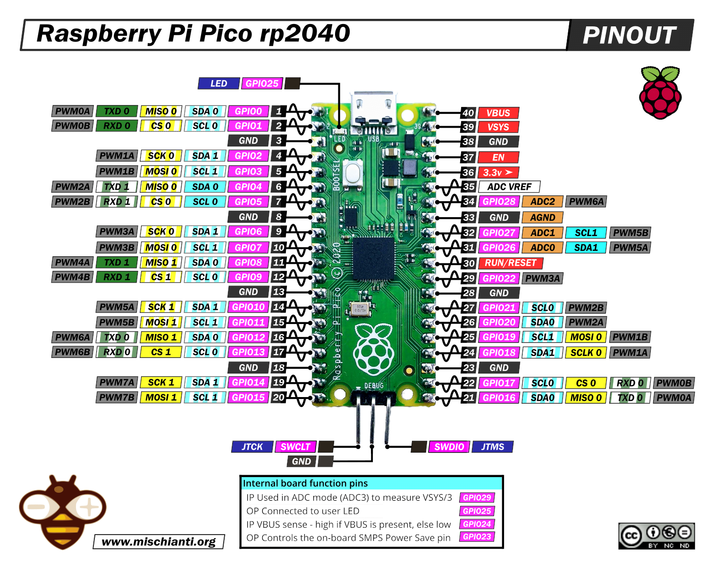
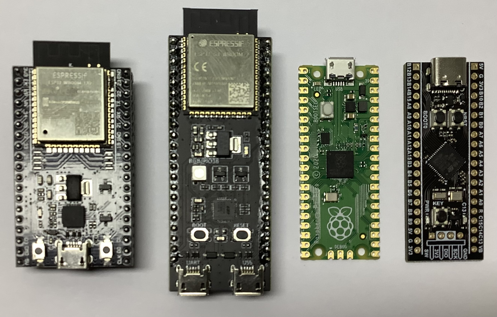

# Badflight

This is a 1500 line Arduino based flight controller, forked from [dRehmFlight](https://github.com/nickrehm/dRehmFlight). It keeps the simple one file design of the excellent original project, but supports ESP32 and RP2040 boards.

# Required Hardware

- Development board: RP2040 (e.g. Raspberry Pi Pico) or ESP32 (e.g. Espressiv DevKitC) 
- SPI or I2C IMU sensor: MPU6050, MP6500, MPU9150, or MPU9250
- RC Receiver: PPM, SBUS, or DMX
- ESC: OneShot125 or 50-490Hz PWM
- Optional servos: 50-490Hz PWM

# Getting Started

1. Setup the USER-SPECIFIED DEFINES section in the main code, and configure the pins in hw.h
2. Connect the IMU sensor and radio receiver to your development board according to the selected pinout.
3. Edit the RC RECEIVER CONFIG section in the main code. Either match you RC equipment to the settings, or change the settings to match your RC equipment. Uncomment print_rcin_RadioPWM() to check.
4. Uncomment print_ahrs_RollPitchYaw() and check that IMU sensor and AHRS are working correctly. Uncomment lines in setup() to calibate the sensor.
5. Connect motors (no props) and battery and check that motor outputs are working correctly. For debugging, use print_out_MotorCommands() and calibrate_ESCs()
6. Mount props, go to an wide open space, and FLY!

# Software Design

- Keep it simple!!!
- No external dependencies, all library code included ```src``` directory
- The main .ino is the full flight controller running standard ```setup()``` and ```loop()```.
- Plain C with minimal function arguments.
- Global variables to communicate between the different functions.
- Function names are prefixed with the module it belongs to:
  - ```loop_``` Main loop control
  - ```imu_``` Inertial Measurement Unit, retrieves accelerometer, gyroscope, and magnetometer sensor data
  - ```ahrs_``` Attitude Heading Reference System, estimates roll, yaw, pitch
  - ```rcin_``` RC INput, retrieves RC receiver data
  - ```control_``` PID controller and output mixer
  - ```out_``` Output to motors and servos
  - ```print_``` Prints debugging info
  - ```calibrate_``` Calibration

## Default Pinout for Raspberry Pi Pico

| Function | GPIO | Board | GPIO | Function |
| --: | :-- | -- |--: | :-- |
| RCIN_TX(tx0) | 0   | USB connector | VBUS     | nc
| RCIN_RX(rx0) | 1   |               | VSYS     | 5V input via diode (*)
|            - | GND |               | GND      | -
|         PWM1 | 2   |               | EN       | nc
|         PWM2 | 3   |               | 3.3V out | 3V3
|         PWM3 | 4   |               | VREF     | nc
|         PWM4 | 5   |               | 28_A2    | FREE
|            - | GND |               | GND      | -
|         PWM5 | 6   |               | 27_A1    | FREE
|         PWM6 | 7   |               | 26_A0    | FREE
|         PWM7 | 8   |               | RUN      | reset button to GND
|         PWM8 | 9   |               | 22       | GYRO_INT
|            - | GND |               | GND      | -
|         PWM9 | 10  |               | 21       | I2C0_SCL
|         PWM10| 11  |               | 20       | I2C0_SDA
|        PWM11 | 12  |               | 19       | SPI0_MOSI
|        PWM12 | 13  |               | 18       | SPI0_SCLK
|            - | GND |               | GND      | -
|        PWM13 | 14  |               | 17       | SPI0_CS
|        PWM14 | 15  | JTAG pins     | 16       | SPI0_MISO

(*) 5V input via diode from BEC. Without a diode take care not connect USB and the battery at the same time!

## Default Pinout for ESP32 DevKitC (38 pin)

| Function | GPIO | Board | GPIO | Function |
| --: | :-- | -- |--: | :-- |
| 3V3 out      | 3V3 | Antenna side            |  GND | GND
| reset button | EN |                            | 23 | I2C_SDA
| VSPI_MISO    | VP 36 input only |              | 22 | I2C_SCL
| GYRO_INT     | VN 39 input only |            | 1 TX | USB Serial Debug TX
| FREE         | 34 input only |               | 3 RX | USB Serial Debug RX
| RCIN_RX      | 35 input only |                 | 21 | VSPI_MOSI
| RCIN_TX      | 32 |                           | GND | GND
| PWM1         | 33 |                            | 19 | VSPI_SCLK
| PWM2         | 25 |                            | 18 | VSPI_CS
| PWM3         | 26 |                       | strap 5 | PMW13
| PWM4         | 27 |                            | 17 | PMW12
| PWM5         | 14 |                            | 16 | PWM11
| PWM6         | 12 |                             | 4 | PWM10
| GND          | GND |                       | boot 0 | PWM9
| PWM7         | 13 |                       | strap 2 | LED     
| nc           | D2 9 flash |              | strap 15 | PWM8
| nc           | D3 10 flash |           | flash 8 D1 | nc
| nc           | CMD 11 flash |          | flash 7 D0 | nc
| 5V in (*)    | 5V | USB connector     | flash 6 CLK | nc

(*) 5V input via diode from BEC. Without a diode take care not connect USB and the battery at the same time!




# Changes from dRehmFlight

- Add support for RP2040 and ESP32
- Dropped Teensy support (but could be re-added, I just don't have the hardware to test on)
- Moved all hardware specific code to hw.h and added hardware specific libraries
- Reduced the number of global variables
- Oneshot is implemented as PWM up to 3.9kHz
- New libs for IMU sensors
- Changed arming logic

# Hardware Considerations

## UAV Controller Requirements

- Arduino support
- 32 bit processor
- At least 21 GPIO pins for:
  - 3x UART: Receiver, GPS, spare/debug (6 pins)
  - 1x SPI: fast IMU (4 pins + 1 interrupt pin)
  - 1x I2C: Magnetometer, Barometer, Current sensor, slow IMU (2 pins)
  - 8x PWM: Motor, Servo (8 pins)
  
## Considered UAV Controller Boards

| Board | ESP32 DevKitC | ESP32-S3 DevKitC | Raspberry Pi Pico (W) | Black Pill |
| --- | :-: | :-: | :-: | :-: |
Board Size | 55 * 28 mm | 69 * 26 mm | 51 * 21 mm | 53 * 21 mm
Board Weight | 6.9 g<br>(9.1 g with headers) | 8.4 g<br>(10.9 g with headers) | 3.0 g | 4.5 g
Board Pins | 38 pins | 44 pins | 40 pins | 40 pins
Available external GPIO pins | 21<br>+ 4 input only<br>+ 1 button: 0<br>Note: strap pin restictions | 25<br>+ 7 external pins but used:<br>Button: 0<br>OSPI: 35, 36, 37<br>RGB LED: 38<br>USB: 19, 20<br>Note: strap pin restictions | 26<br>Internal only:<br>Power save: 23<br>VBUS monitor: 24<br>LED: 25<br>VSYS voltage: 29 ADC3 | 30<br>+ 2 external but used:<br>Button: PA0<br>LED: PC13
PWM | 16<br>(8 timers each with 2 output pins) | 16<br>(8 timers each with 2 output pins) | 16<br>(8 timers each with 2 output pins) | 25<br>(6 * 16bit + 2 * 32bit timers)
Available UART | 3 | 3 | 6 (2 + 4*PIO)<br>+USB Serial debug | 3
Available SPI | 2 | 2 | 2 | 5
Available I2C | 2 | 2 | 2 | 2
Available ADC pins | 16 (12bit) | 20 (12bit) | 3 (12bit) | 10 (12bit)
On Board Peripherals | WIFI + BT + Button | WIFI + BT + Button + RGB LED | LED<br>+ WIFI/BT (W) | Button + LED (+ optional SPI flash)
MCU | ESP32 | ESP32S3 | RP2040 | STM32F411CE/CC
MCU GPIO | 34 | 45 | 30 | 32
Processor | 2 * 240MHz LX6 | 2 * 240MHz LX7 | 2 * 133MHz M0+ | 1 * 100MHz M4
Coremark (single core) | 351 | | 228 | 172
FPU | FPU | FPU | no FPU | FPU
RAM | 320K data<br>132K instruction<br>64K cache | 320K data<br>128K instruction<br>64K cache | 264K data/instr.<br>16K XIP cache | 128K
Flash | 2-16M QuadSPI | 2-16M OctalSPI | 2M QuadSPI | 512K internal (CE)<br>256K internal (CC)
PSRAM | 0-8M | 0-8M | 0 | 0
Board price single piece | $4 | $5 | $4 | $3



# ESP32


# ESP32S3


# STM32F411


## 6-axis IMU

| Part    | Breakout Board? | Interface | Notes |
| ------- | --- | --- | --- |
MPU6000   | yes | SPI, I2C | 8k gyro, 1k acc, WHO_AM_I=0x68 6-bit I2C address of the MPU-60X0, Released 2011 (EOL)
MPU6050   | yes | I2C | 8k gyro, 1k acc, WHO_AM_I=0x68 6-bit I2C address of the MPU-60X0, Released 2011 (EOL)
MPU6500   | $2 | SPI, I2C | 8k gyro, 4k acc, Released 2014
BMI160    | $2
BMI180    |
BMI270    | no | SPI | 6k gyro, Used in current commercial FC
LSM6DS3   | $2
LSM6DSO   | $10
MPU3000   | no | | Released 2011 (EOL)
MPU3050   | no | | Released 2011 (EOL)
MPU6886   | no | | Released
ICM20602  | no
ICM20608  | no
ICM20689  | no 
ICM42688P | no | | 32k gyro, Used in current commercial FC

## 9-axis IMU

| Part    | Breakout Board? | Interface | Notes |
| ------- | --- | --- | --- |
MPU9150  | $7 | I2C | 8k gyro, WHO_AM_I=0x68 or 0x69 depending on AD0 pin, MPU6050 + AK8975, (EOL)
MPU9250  | $4 | SPI 20MHz, I2C | 8k gyro, 4k acc, 100Hz mag, WHO_AM_I=0x71, MPU6000 + AK8963, Released 2014 (EOL)
MPU9255  | $9 | SPI 20MHz, I2C | 8k gyro, WHO_AM_I=0x73, MPU6000 + AK8963
ICM20948 | $9 | SPI 7MHz, I2C | replacement of MPU-9250/9255, Released 2018
LSM9DSO  | no

## Barometer

| Part    | Breakout Board? | Interface | Notes |
| ------- | --- | --- | --- |
DPS310    | $3 | SPI, I2C | Relative precision: 6Pa 0.5m, Resolution 0.06Pa, Used in current commercial FC
BMP180    | $2
BMP280    | $2 | | Used in current commercial FC
BMP388    | $8 | SPI, I2C | Relative precision: 
MS5611    | $4
SPL06-001 | no

## Sensor Modules

| Module | Price | Sensors |
|-|-|-|
GY-85 | | 9DOF ITG3205 + ADXL345 + HMC5883L
GY-86 | | 10DOF MPU6050 HMC5883L MS5611
GY-87 | $4 | 10DOF MPU6050 HMC5883L BMP180
GY-91 | $8 | 10DOF MPU9250 BMP280
GY-521 | $2 | 6DOF MPU6050
GY-912 | $11 | 10DOF ICM20948 BMP388

Hardware Table Remarks
* The "Breakout Board?" column lists price if cheap & easy to find board.
* Prices aliexpress incl shipping.
* Table created Oct 2023

# Flight Controllers in Github

In approximate order of complexity.

- [lobodol/drone-flight-controller](https://github.com/lobodol/drone-flight-controller) Arduino UNO single ino file
- [dRehmFlight](https://github.com/nickrehm/dRehmFlight) Arduino Teensy 4
- Badflight Arduono RP2040/ESP32
- [Crazyflie](https://github.com/bitcraze/crazyflie-firmware) STM32F405
- [esp-drone](https://github.com/espressif/esp-drone.git) ESP32, fork from Crazyflie
- [Betaflight](https://github.com/betaflight/betaflight) STM32
- [Ardupilot](https://github.com/ArduPilot/ardupilot) STM32 or Linux based


